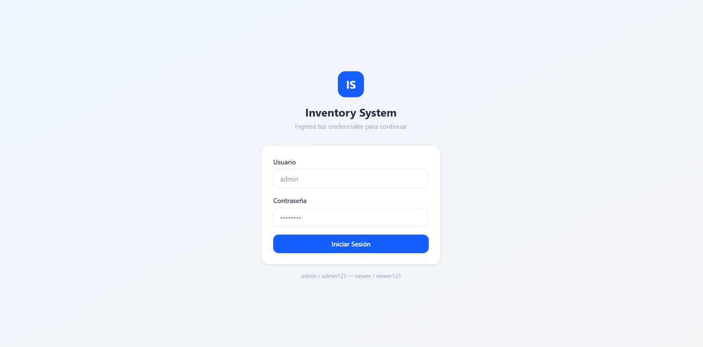
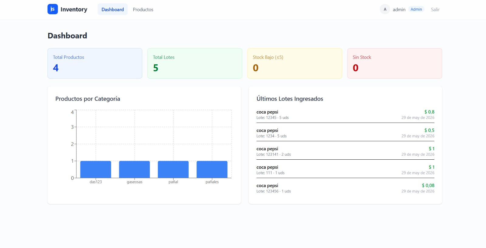
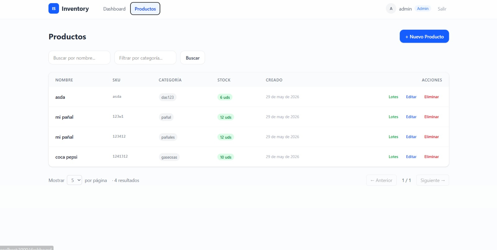
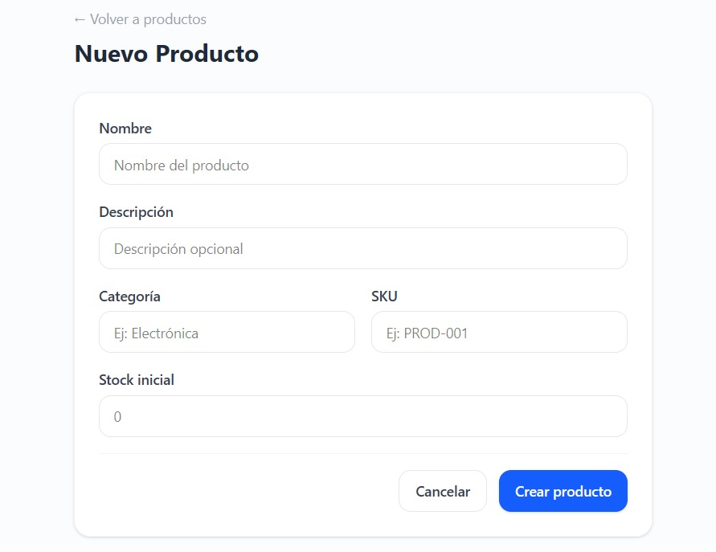
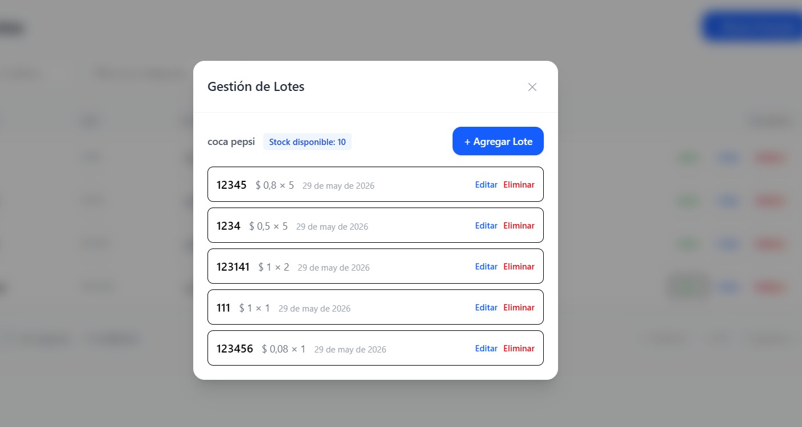
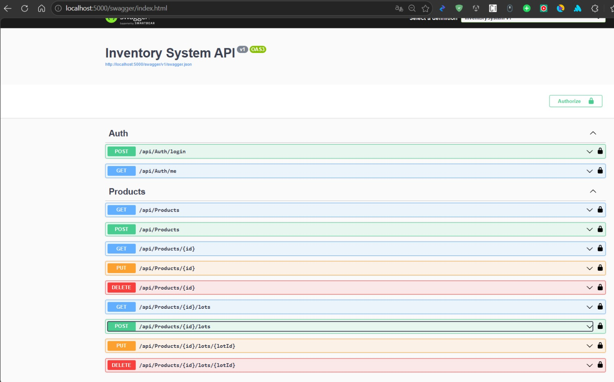

# Inventory System — Prueba Técnica Full Stack

Sistema web de inventario de productos con autenticación JWT, CRUD completo con soporte de múltiples precios por lote/fecha, y listado paginado.

| Capa | Tecnología |
|------|-----------|
| Frontend | React 18 + TypeScript + Vite + Tailwind CSS |
| Backend | .NET 8 Web API + EF Core 8 |
| Base de datos | SQL Server 2022 |
| Contenedores | Docker + Docker Compose |

---

## Levantar con Docker (recomendado)

### Requisitos

- [Docker Desktop](https://www.docker.com/products/docker-desktop/) instalado y corriendo

### Pasos

```bash
# Clonar el repositorio
git clone <url-del-repo>
cd PRUEBAMIGUELBG

# Levantar todo el stack
docker-compose up --build
```

Eso es todo. Docker levanta los 3 servicios:

| Servicio | URL | Descripción |
|----------|-----|-------------|
| Frontend | http://localhost:3000 | Aplicación React |
| Backend (API) | http://localhost:5000 | API .NET 8 |
| Swagger | http://localhost:5000/swagger | Documentación interactiva |
| SQL Server | localhost:1433 | Base de datos |

> El backend aplica migraciones y seed de datos automáticamente al arrancar. No se requiere ningún paso adicional.

### Nota sobre la comunicación Frontend → Backend en Docker

En Docker, el frontend se sirve con nginx. Las peticiones a `/api/*` se redirigen internamente al contenedor del backend mediante un proxy en nginx. El frontend no necesita conocer la URL del backend directamente.

La variable `VITE_API_URL` en el `docker-compose.yml` es solo documentativa — Vite inyecta variables de entorno en build time, no en runtime. El `.dockerignore` excluye el `.env` local para que el build en Docker use rutas relativas (`/api/...`) que nginx proxea al backend.

### Comandos útiles

```bash
# Detener todo
docker-compose down

# Detener y borrar volúmenes (resetea la BD)
docker-compose down -v

# Ver logs del backend
docker-compose logs -f backend

# Reconstruir un servicio específico
docker-compose up --build backend
```

---

## Levantar sin Docker (desarrollo local)

### Requisitos

- [.NET 8 SDK](https://dotnet.microsoft.com/download/dotnet/8.0)
- [Node.js 18+](https://nodejs.org/) (incluye npm)
- [SQL Server 2022](https://www.microsoft.com/sql-server) (local o remoto)

### 1. Base de datos

Asegúrate de tener una instancia de SQL Server corriendo. Puedes usar:

- SQL Server local instalado
- SQL Server en Docker (solo la instancia):

```bash
docker run -e "ACCEPT_EULA=Y" -e "SA_PASSWORD=Admin@admin1" -p 1433:1433 -d mcr.microsoft.com/mssql/server:2022-latest
```

### 2. Backend

```bash
cd backend/InventorySystem

# Restaurar paquetes
dotnet restore

# Ejecutar la API (crea la BD y aplica migraciones automáticamente)
dotnet run
```

La API estará disponible en: http://localhost:5139 (o el puerto que indique la consola)

> Al arrancar, el backend ejecuta `Database.Migrate()` y el `DbSeeder` automáticamente.

### 3. Frontend

```bash
cd frontend

# Instalar dependencias
npm install

# Ejecutar en modo desarrollo
npm run dev
```

El frontend estará disponible en: http://localhost:5173

En desarrollo local, el archivo `frontend/.env` define `VITE_API_URL=http://localhost:5000` para que las peticiones apunten al backend. Si tu backend corre en otro puerto, ajusta esa variable.

### Configuración de conexión

Si tu SQL Server usa credenciales diferentes, edita `backend/InventorySystem/appsettings.json`:

```json
{
  "ConnectionStrings": {
    "DefaultConnection": "Server=localhost,1433;Database=InventoryDB;User Id=sa;Password=Admin@admin1;TrustServerCertificate=True"
  }
}
```

---

## Usuarios de prueba

El sistema crea automáticamente 2 usuarios al iniciar:

| Usuario | Contraseña | Rol | Permisos |
|---------|-----------|-----|----------|
| admin | admin123 | Admin | CRUD completo |
| viewer | viewer123 | Viewer | Solo lectura |

---

## Estructura del proyecto

```
PruebaBG/
├── frontend/          # React 18 + TypeScript + Vite
├── backend/           # .NET 8 Web API
├── database/          # Dockerfile SQL Server
├── docker-compose.yml # Orquestador
├── .gitignore
└── README.md
```

---

## Comandos de desarrollo útiles

### Backend

```bash
# Crear nueva migración
dotnet ef migrations add NombreMigracion --project backend/InventorySystem

# Aplicar migraciones manualmente
dotnet ef database update --project backend/InventorySystem

# Compilar
dotnet build backend/InventorySystem
```

### Frontend

```bash
# Build de producción
npm run build --prefix frontend

# Lint
npm run lint --prefix frontend
```

---

## Evidencia

### Login


### Dashboard


### Productos


### Nuevo Producto


### Gestión de Lotes


### Documentación Swagger

